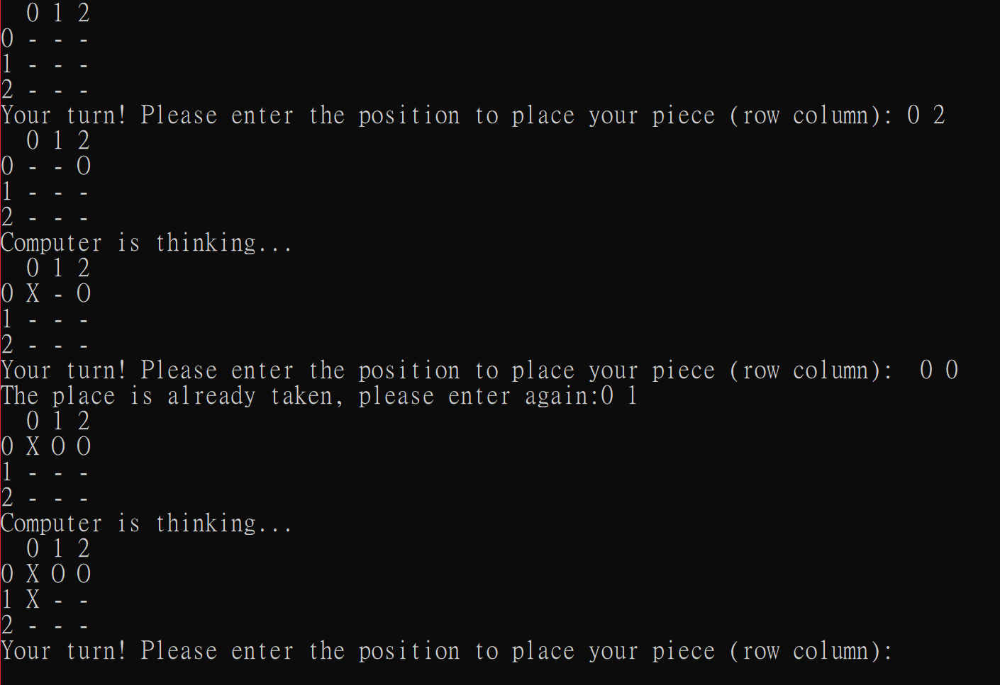
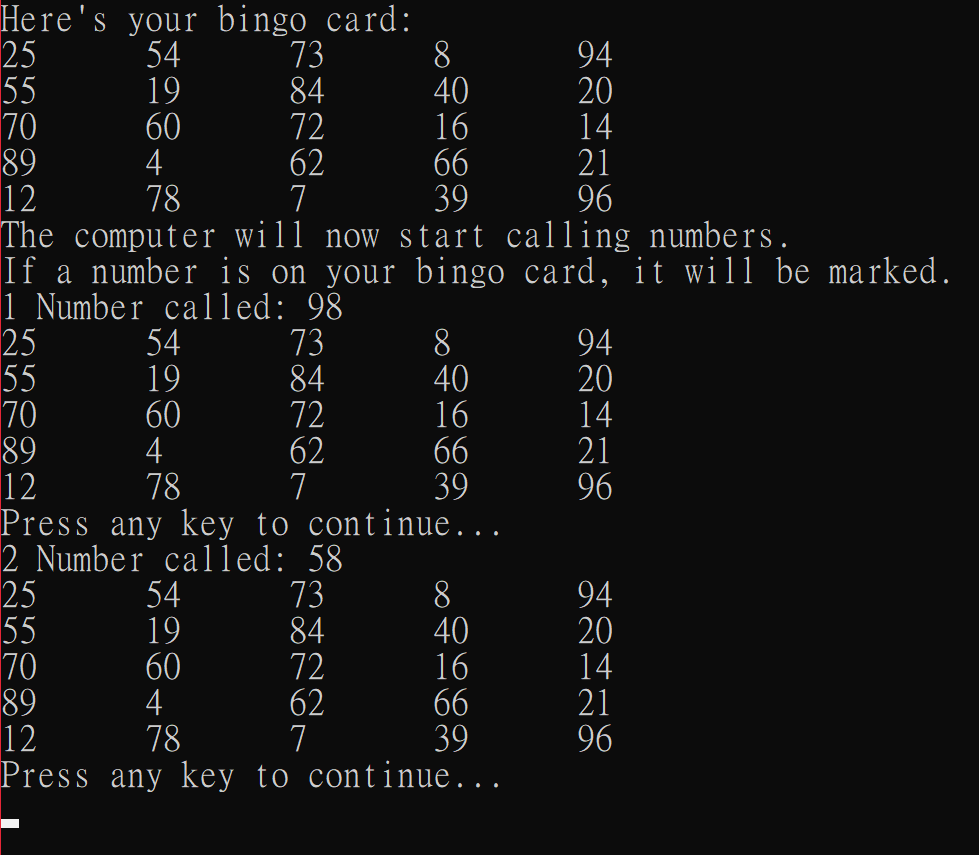
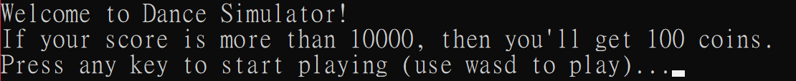
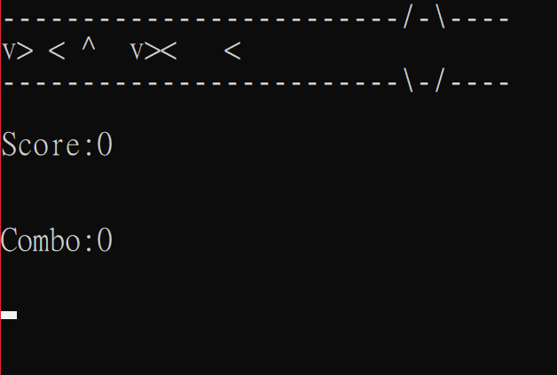
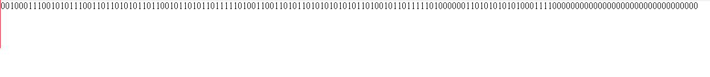

## Introduction 
In this project, all functions are coded in a single cpp file.  
This project contains 6 main functions: login, menu, tic-tac-toe, bingo, dance simulator, and saving.  
The structure of the operation is
#### login &rArr; menu &rArr; games (tic-tac-toe, bingo, or dance simulator) or system options (change user or exit).  
  
### Login:
  
  
The login page consists of user name and password, recorded in "Account.txt" file. When the typed user name and password matches those in the lines in "Account.txt",
 it will read the balance of the user and goes into menu.

 ### Account:  
  
 
The "Account.exe" file is separated line by line. Each line contains account name, account password, and account balance.
  
### Menu:  

  
There are 5 options in menu: tic-tac-toe, bingo, dance simulator, change user, and exit.  User can use w/s to choose options they want and press enter to get into those options. 
If user choose "change user" option, the system will save the balance into "Account.txt" and go back to Login interface.  When exit is chosen, the balance will be recorded, too. 

### Games:

#### Tic-tac-toe:
  

If user choose tic-tac-toe option, the system will go to the tic-tac-toe game. In this game, user can enter row and column to place your circles. After placing, there will be random place taken
to simulate computer thinking. If one site has 3 circles/cross linked, the game is over. If user wins, user will get 100 coins.

#### Bingo:

In bingo game, there is a random 5x5 matrix where every element are distinct from 1 to 100. User can press any key to obtain a random number also from 1 to 100.  If the random number is in the matrix, 
the element in the matrix will be marked. When there is a linked line in the matrix, user wins and user will get 100 coins. If no linked line in the matrix after 50 numbers called, user loses and loss 
100 coins.

#### Dance Simulator:

In dance simulator, user can use wasd to play the game.  There's 2 types of judgement of the game: perfect and miss.  When user reaches perfect, the score and combe rise. When user misses, the combo resets, 
which is an indicator of the speed in score increasing.  After the game, if user reaches 10000 scores, user obtain 100 coins.  Otherwise, no coins earned.

#### Song:

The dance simulator is operated in "song.txt".  The elements in "song.txt" represents the press. If the element is 1, an arrow will be generated to make user pressing the responsive keys. If it's 0, then nothing 
needed to be press.
